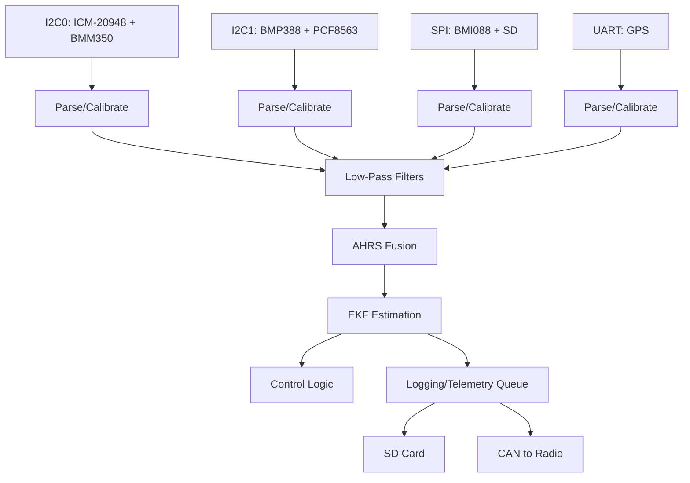

# Communication Document for MARV Project

## Document Overview

This communication document delineates the intra-module and inter-module interfaces within the MARV project, encompassing the Flight Controller (FC), Radio module, and Ground Station (GS). It specifies protocols, data flows, and formats to ensure efficient, reliable exchanges aligned with the high-level design objectives of sub-millisecond latency, fault tolerance, and modularity. All communications adhere to the Arduino environment, leveraging Arduino core for peripheral management and FreeRTOS for task scheduling. The document draws inspiration from open-source UAV firmwares such as ArduPilot and Betaflight, emphasizing lightweight protocols for internal transfers and MAVLink v2 for external telemetry.

Key principles include:
- Minimizing overhead for real-time operations.
- Incorporating CRC-16-CCITT validation for integrity.
- Supporting phased development, with telemetry-only modes for validation.

## Intra-Module Communications

### Flight Controller (FC)
- **Sensors to FC Interfaces**:
  - **I2C Devices**: BMP388 barometer and PCF8563 RTC on I2C1 (GP2 SDA, GP3 SCL); BMM350 magnetometer and ICM-20948 IMU on I2C0 (GP20 SDA, GP21 SCL). Use Wire library for access with timeouts. Data acquisition uses DMA where supported, parsing raw bytes into calibrated structures (e.g., floating-point pressure or quaternion orientations) via Adafruit libraries.
  - **SPI Devices**: BMI088 IMU and SD card on SPI0; MCP2515 CAN controller on SPI1. Use SPI library and ArduinoMCP2515 for transfers, offloading to DMA where possible.
  - **UART Devices**: Ublox NEO-M9N GPS on UART0 (GP0 TX, GP1 RX). Use Serial library with TinyGPS++ for parsing NMEA/UBX sentences into position/velocity data.
- **Internal Data Flow to Algorithms**:
  - **Sensor Acquisition**: Raw data from peripherals is parsed and calibrated in driver-layer tasks, queued for application-layer processing on Core 0.
  - **To Low-Pass Filters**: Parsed sensor data (e.g., gyro/accel from IMUs) passes through custom floating-point low-pass filters (e.g., Butterworth implementation) to reduce noise before fusion.
  - **To AHRS**: Filtered gyro, accel, and magnetometer data feed the AHRS library (e.g., Madgwick) for quaternion-based attitude computation, executed in FreeRTOS tasks at 100 Hz.
  - **To EKF**: AHRS outputs, combined with GPS position/velocity and barometer altitude, input to the EKF library for state estimation (position, velocity, orientation). EKF runs on Core 0 with FPU/DSP optimizations, updating at 50-100 Hz.
  - **To Control Logic**: EKF estimates drive class-based controllers (e.g., PID) for actuator commands via PIO.
  - **Logging and Queuing**: Processed data is queued for SD logging (Core 1) or forwarded to Radio via CAN.

### Radio Module
- **Internal Interfaces**:
  - **LoRa Radio (E32900T30D)**: UART0 (GP0 TX, GP1 RX) for bidirectional MAVLink v2 packet transmission/reception at 915 MHz. Use Serial for RX to capture incoming packets, including RSSI/SNR metadata.
  - **CAN Controller (MCP2515)**: SPI0 for receiving raw data from FC, using ArduinoMCP2515 library.
- **Internal Processing**: Incoming CAN frames are parsed, appended with LoRa RSSI/SNR, and encoded into MAVLink v2 using MAVLink library. Outbound MAVLink from GS is decoded and forwarded via CAN.

### Ground Station (GS)
- **Internal Interfaces**:
  - **LoRa Radio (E32900T30D)**: UART0 (GP0 TX, GP1 RX) for wireless MAVLink v2 reception/transmission at 915 MHz.
- **To Computer**: GS forwards decoded MAVLink packets to a connected computer (e.g., via USB serial) for ground station software (e.g., QGroundControl) to monitor telemetry and send commands.

## Inter-Module Communications

- **FC to Radio**: Via CAN bus (MCP2515 controllers). Uses a lightweight protocol: MultiWii Serial Protocol (MSP), adapted for CAN framing. MSP is a binary format from Betaflight, chosen for its efficiency in drone telemetry (header: start byte + direction + size + type; payload: sensor data; checksum: XOR). Raw data includes batched sensor outputs (e.g., IMU accelerations, GPS positions) at 20-50 Hz. CAN messages wrap MSP frames (payload <8 bytes per frame for efficiency), with token passing for arbitration as in current code. CRC-16-CCITT on all packets.
- **Radio to GS**: Wireless via LoRa at 915 MHz. Protocol: MAVLink v2 for standardized telemetry/commands. Radio receives MSP-wrapped raw data from FC, appends LoRa RSSI/SNR (e.g., in RADIO_STATUS message), and encodes into MAVLink packets (e.g., ATTITUDE, GPS_RAW_INT). Transmission at configurable rates (e.g., 10-50 Hz) to balance bandwidth.
- **GS to Radio (and Reverse Flows)**: Bidirectional LoRa with MAVLink v2. GS sends commands (e.g., mode changes) to Radio, which decodes and forwards via MSP over CAN to FC.

## Visual Roadmaps for Data Flow

### Overall Inter-Module Flow
```mermaid
graph TD
    subgraph FC
        Sensors[Sensors (I2C/SPI/UART)] --> FCAlgo[Algorithms (AHRS/EKF/Control)]
        FCAlgo --> MSPQueue[MSP Queue]
        MSPQueue --> CANTx[CAN TX to Radio]
    end

    subgraph Radio
        CANRx[CAN RX from FC] --> MSPParse[MSP Parse + Append RSSI/SNR]
        MSPParse --> MAVEncode[MAVLink v2 Encode]
        MAVEncode --> LoRaTx[LoRa TX to GS]
        LoRaRx[LoRa RX from GS] --> MAVDecode[MAVLink Decode]
        MAVDecode --> MSPForward[MSP Forward via CAN to FC]
    end

    subgraph GS
        LoRaRxGS[LoRa RX from Radio] --> MAVDecodeGS[MAVLink Decode]
        MAVDecodeGS --> Computer[Computer Interface]
        Computer --> MAVEncodeGS[MAVLink Encode Commands]
        MAVEncodeGS --> LoRaTxGS[LoRa TX to Radio]
    end

    Sensors -->|Raw Data| FCAlgo
    FCAlgo -->|Estimates| MSPQueue
    CANTx --> CANRx
    LoRaTx --> LoRaRxGS
    LoRaTxGS --> LoRaRx
```

### Intra-FC Data Flow to Algorithms


